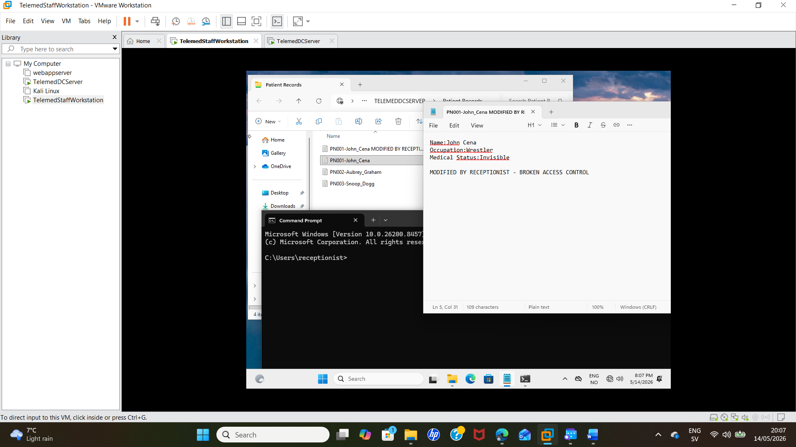
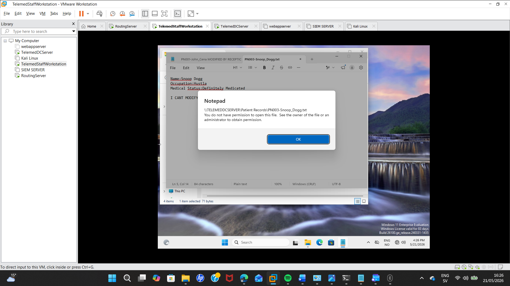
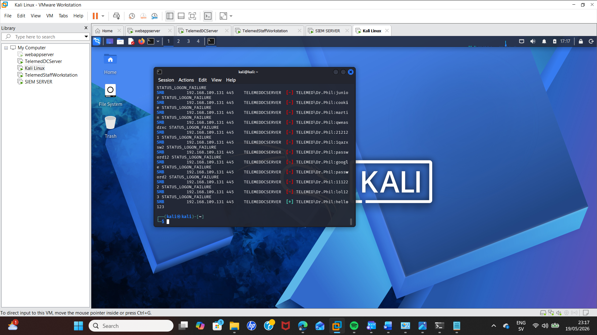
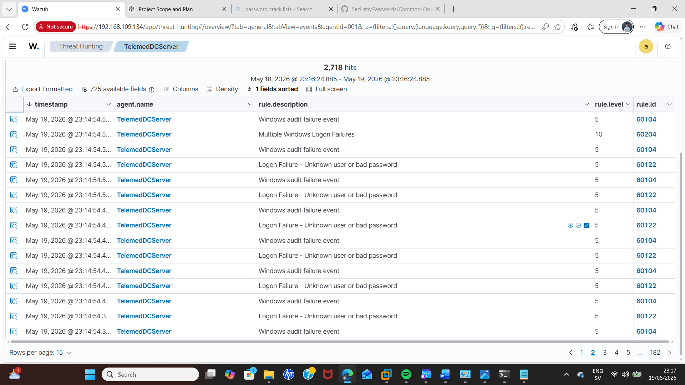
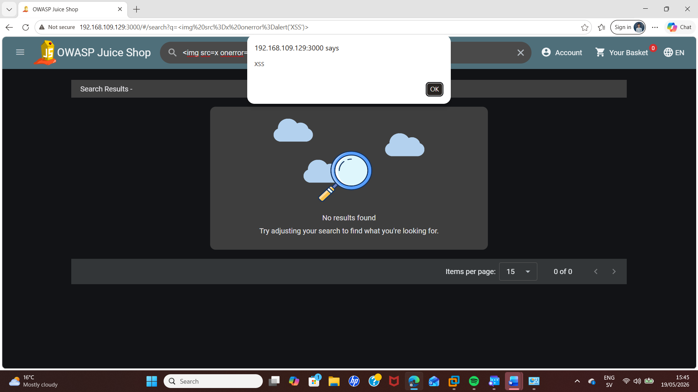
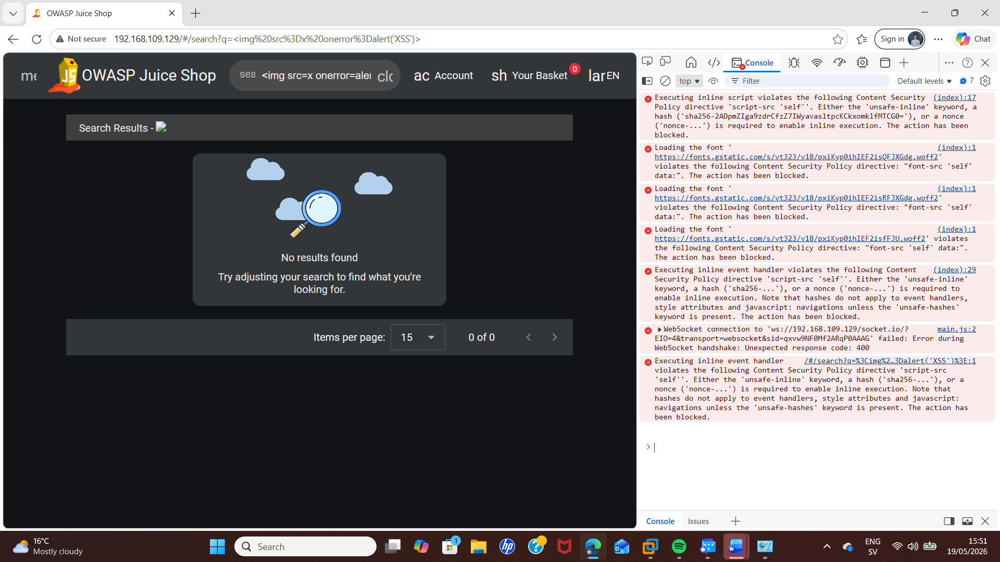
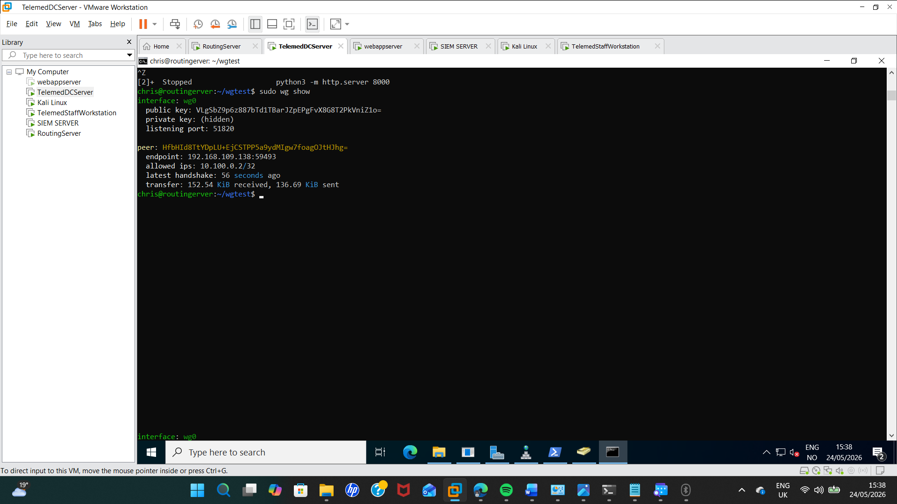
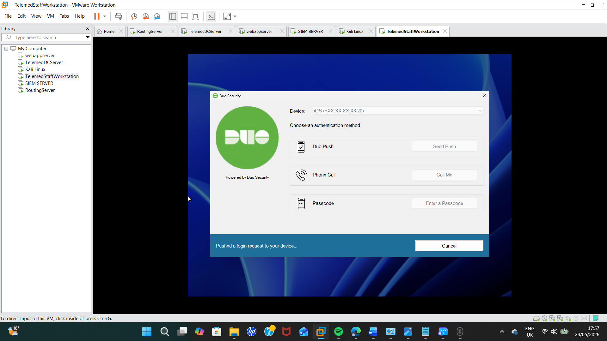

# Telemedicine Enterprise Security Lab

A multi-system cybersecurity lab designed to simulate the security assessment and improvement of a small telemedicine company's enterprise environment.

The project combines Windows Server and Active Directory, Linux infrastructure, network segmentation, SIEM monitoring, penetration testing, secure remote access, multi-factor authentication and web application security.

The objective was not simply to deploy security technologies, but to identify weaknesses, demonstrate their potential impact, implement appropriate controls and then validate whether those controls were effective.

---

## Lab Overview

The environment was designed around a fictional telemedicine company handling sensitive patient information.

The lab incorporated:

- Windows Server and Active Directory
- Windows client workstation
- Ubuntu Linux servers
- Kali Linux attacker/testing system
- Wazuh SIEM
- Network segmentation and access-control rules
- WireGuard VPN
- Duo multi-factor authentication
- Web application security testing
- OWASP Juice Shop
- Nginx and Content Security Policy (CSP)

Testing was performed in an isolated virtual lab environment for educational purposes.

---

## 1. Active Directory & Access Control

A Windows Server Domain Controller was configured to provide centralised identity and access management.

Active Directory users and groups were organised according to business roles including doctors, nurses and receptionists.

During the security assessment, an access-control weakness was identified in the group structure.

The receptionist group had been incorrectly nested inside a Domain Local group with read/write permissions to patient records. As a result, receptionist accounts inherited permissions that were not appropriate for their role.

### Testing Evidence

**Before mitigation:** A receptionist account was able to access and modify sensitive patient information due to the incorrectly assigned permissions.

The issue was remediated by removing the receptionist group from the read/write group and assigning it to the appropriate read-only group.

**After mitigation:** The test was repeated using the receptionist account and modification of the patient data was denied.

This demonstrated the importance of correct group nesting, least privilege and role-based access control within Active Directory environments.

---

## 2. Password Security Testing

The Active Directory password configuration was assessed to identify weaknesses that could increase the likelihood of credential compromise.

For testing purposes, the environment contained deliberately weakened password controls, including:

- Reduced minimum password length
- Disabled password complexity requirements
- Lack of an effective account-lockout policy

A controlled credential attack was then performed from Kali Linux using CrackMapExec and a password list containing commonly used passwords.

### Testing Evidence

Under the deliberately weakened password policy, CrackMapExec successfully identified the password of a test domain user.

The test demonstrated how weak password requirements and insufficient protection against repeated authentication attempts can significantly increase the risk of account compromise.

The findings highlighted the importance of stronger password requirements, account-lockout controls and additional authentication mechanisms such as MFA.

---

## 3. Security Monitoring with Wazuh

Wazuh was deployed as the Security Information and Event Management (SIEM) platform for the environment.

Agents were connected to systems including the Domain Controller and Linux web application server, allowing security-relevant events to be collected and investigated centrally.

Security events were deliberately generated within the lab to test whether suspicious authentication activity could be detected.

These included:

- Failed Windows login attempts
- Failed SSH authentication attempts
- Simulated password-spraying activity

### Detection Evidence

The generated authentication events were successfully collected by Wazuh and could be investigated through its security monitoring and threat-hunting interfaces.

The example below shows alerts generated during a simulated password-spraying attack.

The exercise demonstrated how centralised logging and SIEM monitoring can improve visibility across an environment and assist analysts in identifying suspicious authentication behaviour.

---

## 4. Network Segmentation & ACL Testing

The original lab environment used a flat network in which systems shared the same subnet.

This design increased the potential attack surface because a compromised or unauthorised device could perform reconnaissance against other systems on the network.

### Reconnaissance Before Segmentation

A controlled Nmap scan was performed from Kali Linux.

The scan was able to discover internal infrastructure, including the web application server and Domain Controller.

This demonstrated how a flat network can provide an attacker with valuable information about available systems and services.

The network architecture was subsequently redesigned around a routing server with multiple network interfaces separating different types of systems.

The segmented environment separated areas such as:

- Client/staff systems
- Domain and infrastructure services
- Security services
- Web/application services
- Guest/untrusted systems

Access Control List (ACL) rules were configured on the routing server to restrict communication between networks.

A default-deny approach was used so that only explicitly required traffic was permitted between network segments.

The objective was to reduce unnecessary communication paths and limit the ability of a compromised system to move laterally through the environment.

---

## 5. Web Application Security

Web application security testing was performed against an intentionally vulnerable application hosted within the lab environment.

OWASP Juice Shop was used to demonstrate web application vulnerabilities in a controlled environment.

Testing focused particularly on Cross-Site Scripting (XSS).

A harmless JavaScript alert payload was submitted through a user-input field to determine whether input was being handled securely.

### Exploitation Evidence

**Before mitigation:** The submitted XSS payload successfully executed JavaScript in the browser.

This demonstrated the potential impact of insufficient handling of untrusted user input.

As an additional defensive layer, an Nginx reverse proxy was configured with a Content Security Policy (CSP).

The policy restricted the sources from which scripts could execute.

### Mitigation Evidence

**After mitigation:** The attack was repeated after the CSP had been implemented. The browser prevented the injected script from executing.

The underlying application remained intentionally vulnerable; CSP was implemented as an additional defensive control rather than presented as a replacement for secure application code and appropriate input handling.

This exercise demonstrated both exploitation and mitigation while highlighting the value of defence in depth.

---

## 6. Secure Remote Access with WireGuard

WireGuard was implemented to provide secure remote access to internal resources.

The VPN server was configured on the Linux routing system and a Windows workstation was configured as the remote client.

To simulate an employee connecting from outside the organisation, the workstation was moved away from the internal network and connected through a separate NAT-based network.

Without the VPN connection, internal resources were not reachable.

During implementation, configuration issues were encountered involving the permitted IP ranges and cryptographic key configuration.

These issues were investigated and corrected before the VPN configuration was retested.

### VPN Validation

After troubleshooting the client/server configuration and regenerating the required keys, a successful WireGuard handshake was established between the remote workstation and routing server.

The internal web resource could then be accessed successfully through the VPN tunnel.

When the VPN was disconnected, the internal resource was no longer reachable.

This demonstrated how authenticated VPN access could be used to restrict remote access to internal company resources.

---

## 7. Multi-Factor Authentication

Multi-factor authentication was implemented to provide an additional layer of protection against compromised credentials.

Duo was integrated with Windows authentication in the lab environment.

### MFA Validation

A test domain user who had not enrolled a second-factor device was initially prevented from logging in.

After enrolment, the Windows authentication process triggered the configured MFA challenge.

Authentication was subsequently completed using the enrolled mobile device and the successful authentication could be verified through the Duo logs.

The exercise demonstrated how MFA can reduce the likelihood that possession of a username and password alone will result in successful account compromise.

---

## Security Findings

The assessment identified several security weaknesses within the original environment:

| Finding | Risk | Mitigation |
|---|---|---|
| Incorrect Active Directory group permissions | Unauthorised modification of sensitive data | Corrected group nesting and applied least privilege |
| Weak password policy | Increased risk of credential compromise | Stronger password controls and MFA |
| Flat network architecture | Increased reconnaissance and lateral-movement opportunities | Network segmentation and ACLs |
| Insufficient web application protection | XSS execution | CSP implemented as an additional defensive layer |
| Limited central security visibility | Suspicious activity could be difficult to identify | Wazuh SIEM deployment |
| Unprotected remote access | Internal resources potentially exposed to remote-access risks | WireGuard VPN |
| Password-only authentication | Compromised credentials could provide account access | Duo MFA |

---

## Key Skills Demonstrated

### Cybersecurity

- Security assessment
- Vulnerability identification
- Security monitoring
- Incident detection
- Access-control testing
- Web application security testing
- Credential security testing
- Defence in depth

### Networking

- TCP/IP networking
- Network segmentation
- Routing
- Access Control Lists
- Network reconnaissance
- Secure remote access
- VPN configuration

### Windows & Identity

- Windows Server
- Active Directory Domain Services
- Active Directory users and groups
- Group-based access control
- Group Policy
- Authentication security
- Multi-factor authentication

### Linux & Security Tools

- Ubuntu Linux
- Kali Linux
- Wazuh SIEM
- Nmap
- CrackMapExec
- WireGuard
- Nginx
- OWASP Juice Shop

---

## What I Learned

This project provided practical experience working across multiple areas of enterprise cybersecurity rather than treating each security technology in isolation.

One of the most valuable parts of the project was following the full security-testing process:

**identify a weakness → demonstrate its impact → implement a mitigation → retest the environment**

Examples included correcting excessive Active Directory permissions and confirming that the user could no longer modify sensitive data, implementing CSP and confirming that the XSS test was blocked, and deploying Wazuh before generating authentication attacks to verify that the activity could be detected.

The project also provided useful troubleshooting experience. The WireGuard implementation, for example, initially failed because of configuration and key-related issues. Diagnosing and correcting these problems was an important part of understanding how the technology operated rather than simply following a successful installation process.

Overall, the lab strengthened my understanding of how identity, networking, monitoring, endpoint security, web security and remote-access controls interact within an enterprise environment.

---

## Future Development

I plan to continue developing the lab as my cybersecurity studies progress.

Potential future improvements include:

- More advanced Wazuh detection rules and dashboards
- Automated alerting and incident-response workflows
- Additional attack simulations
- Improved network monitoring
- Further Active Directory security testing
- Cloud integration
- Investigation of AI-assisted security monitoring and incident-response technologies

---

## Disclaimer

This project was completed in an isolated virtual lab environment for educational purposes.

All attack techniques and security testing described in this repository were performed against systems created specifically for the project. No testing was performed against systems without authorisation.
